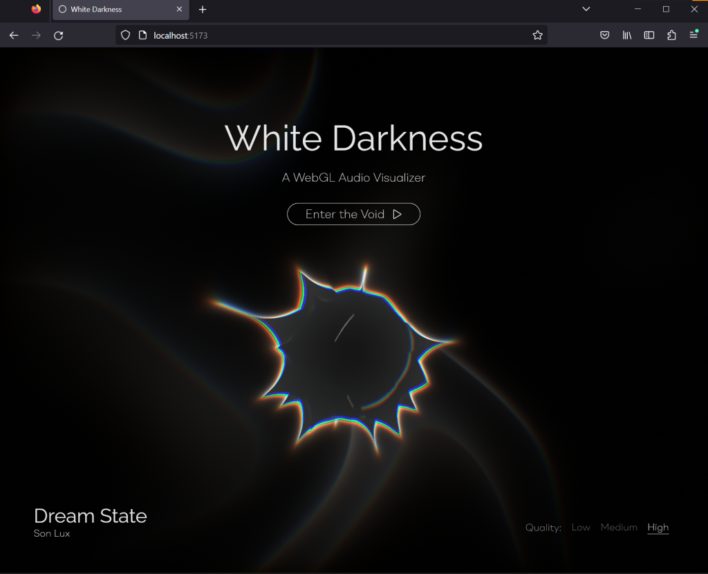

# white-darkness
<p align="center">
  
</p>

A 3D interactive WebGL audio visualizer. The spikeball is drawn via raymarching
through a bounding volume. It utilizes iq's implementation of the
[Inverse Spherical Fibonacci algorithm](https://www.shadertoy.com/view/lllXz4)
to create spikes uniformly spaced apart with varying heights. It reacts to
audio by sampling frequency data from the song (done via the browsers builtin
Web Audio API) and thus is not hardcoded to this specific song. The background
is drawn by triplanar mapping some sinusoidal warp noise onto a skybox.

This experiment was heavily inspired by [Flopine's ShaderTober - Dark](https://www.shadertoy.com/view/3dtXRj)
but I spiced it up a bit by adding some chromatic aberration and camera shake
along with Fibonacci repetition over a sphere.

## Development
```bash
npm install # install dependencies (only need to be run once)
npm run dev # start dev server
```

## Build
```bash
npm run build
npm run preview # locally preview what you just built
```
